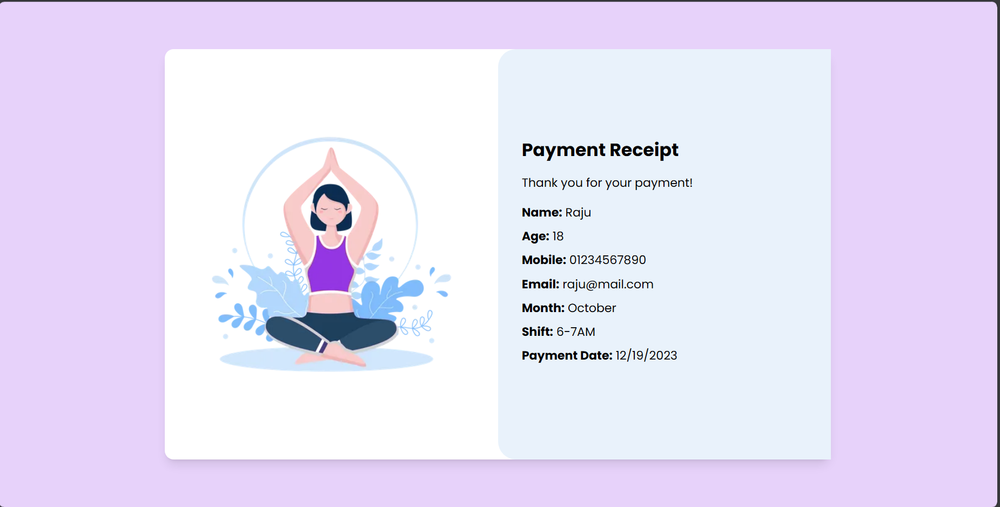

## Steps to setup locally

First clone the repository
```
git clone https://github.com/sohamtembhurne/yoga-app.git
```

### Frontend

Run 
```bash
cd client
npm install
```

Create a .env with following variables
```
REACT_APP_API_URL=http://localhost:5500
```

Now the frontend is running

### Backend

Run 
```bash
cd server
npm install
```

Create a .env with following variables
```
MONGODB_URL=mongodb+srv://<your mongo credentials>.mongodb.net/db
PORT = 5500
```

Change port in both client and server .env files to use other ports


Below is the ER diagram for the web application


## Website Screenshots

### Home Page


### Other Pages


